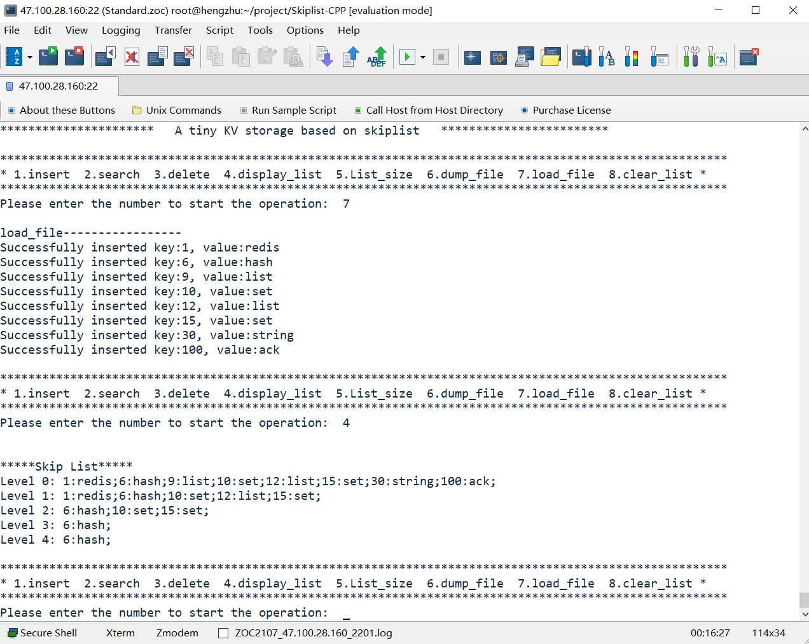

# KV存储引擎

从所周知，非关系型数据库redis，以及levedb，rockdb其核心存储引擎都是使用跳表实现的。

本项目就是基于跳表实现的轻量级键值型存储引擎，使用C++实现插入数据、查询数据、删除数据、数据展示、数据库大小、数据库清空、数据落盘以及文件加载数据。

在随机写读情况下，该项目每秒可处理啊请求数（QPS）: 5.76w，每秒可处理读请求数（QPS）: 4.81w
项目采用模板实现泛型编程，并利用智能指针管理动态内存，避免了内存泄漏和引用非法内存指针的问题。

# 项目中文件

* main.cpp 包含skiplist.h使用跳表进行数据操作
* skiplist.h 跳表核心实现
* README.md 中文介绍      
* bin 生成可执行文件目录 
* makefile 编译脚本
* store 数据落盘的文件存放在这个文件夹 
* stress_test_start.sh 压力测试脚本
* LICENSE 使用协议

# 提供接口

* insertElement（插入数据）
* deleteElement（删除数据）
* searchElement（查询数据）
* displayList（展示已存数据）
* clear_list （数据库清空）
* dumpFile（数据落盘）
* loadFile（加载数据）
* size（返回数据规模）


# 存储引擎数据表现

## 插入操作

跳表树高：20 

采用随机插入数据测试：


|插入数据规模（万条） |耗时（秒） |
|---|---|
|10 |1.57313 |
|50 |8.35985 |
|100 |18.0087 |


每秒可处理写请求数（QPS）: 5.76w

## 取数据操作

|取数据规模（万条） |耗时（秒） |
|---|---|
|10|1.90038 |10|
|50|8.97026 |50|
|100|20.13509 |100|

每秒可处理读请求数（QPS）: 4.81w

# 项目运行方式

```
make            // complie demo main.cpp
./bin/main      // run 
```

如果想自己写程序使用这个kv存储引擎，只需要在你的CPP文件中include skiplist.h 就可以了。
可以运行如下脚本测试kv存储引擎的性能（当然你可以根据自己的需求进行修改）

```
sh stress_test_start.sh 
```
# 项目展示


